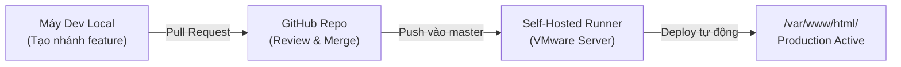

# AASC Audit Platform - Bitrix24 D7 Enterprise Solution

Dự án tùy biến và mở rộng hệ thống CRM Bitrix24 D7 cho **Hãng Kiểm toán AASC**, phục vụ quy trình tiếp nhận, thẩm định hồ sơ, kiểm soát dự toán phí và tự động hóa phê duyệt dịch vụ kiểm toán độc lập.

---

## 1. Cấu trúc thư mục chuẩn Enterprise

Dự án áp dụng nguyên tắc **Clean Core** của 1C-Bitrix (tuyệt đối không can thiệp hay commit mã nguồn lõi `/bitrix/` và dữ liệu người dùng `/upload/`):

```text
aasc-audit/
├── .github/
│   └── workflows/
│       └── deploy.yml              # Pipeline CI/CD tự động kích hoạt khi merge vào master
├── local/                          # Toàn bộ mã nguồn phát triển riêng của dự án
│   ├── modules/
│   │   └── aasc.audit/             # Custom Module chuẩn Bitrix D7
│   │       ├── .settings.php       # Định tuyến Controller API Gateway
│   │       ├── include.php         # Khởi tạo nạp module
│   │       └── lib/
│   │           ├── controller/     # Action Controllers (Request.php, Approval.php)
│   │           ├── handler/        # Event Handlers (LeadApprovalHandler.php)
│   │           ├── model/          # D7 ORM DataManager (AuditRequestTable.php)
│   │           └── service/        # CrmBridgeService.php
│   ├── components/
│   │   └── aasc/
│   │       └── audit.request/      # Component giao diện Form nộp đơn kiểm toán
│   ├── templates/
│   │   └── aasc_portal/            # Site Template chuẩn D7 Asset Manager
│   └── php_interface/
│       ├── init.php                # Bootstrap toàn cục (nạp .env, includeModule, event handlers)
│       └── scripts/                # Kịch bản bảo trì, seed data và test E2E
├── portal/                         # Giao diện cổng thông tin khách hàng công khai (/portal/)
│   ├── index.php                   # Trang chủ cổng thông tin AASC
│   ├── request/                    # Trang điền form yêu cầu kiểm toán
│   └── services/                   # Danh mục dịch vụ (Tối ưu qua Redis Tagged Cache)
├── .env.example                    # File mẫu khai báo các biến môi trường
├── .gitignore                      # Loại trừ file nhạy cảm, core /bitrix/ và /upload/
├── composer.json                   # Quản lý thư viện phụ thuộc (phpdotenv, phpunit)
└── README.md
```

---

## 2. Quản lý cấu hình qua `.env` (12-Factor App)

Mọi thông số nhạy cảm (thông tin đăng nhập Redis, DB, URL dịch vụ bên ngoài) được tách rời hoàn toàn khỏi mã nguồn:

1. Tạo file `.env` trên máy chủ (dựa trên `.env.example`):
   ```bash
   cp .env.example .env
   ```
2. Cấu hình các tham số thực tế:
   ```env
   APP_ENV=production
   REDIS_HOST=127.0.0.1
   REDIS_PORT=6379
   REDIS_PASSWORD=AascAnsibleRedisPass2026!
   REDIS_CHANNEL=bitrix:pull:events
   N8N_WEBHOOK_URL=http://127.0.0.1:5678/webhook/audit-lead-created
   ```
3. Hệ thống nạp tự động qua thư viện `vlucas/phpdotenv` trong `local/php_interface/init.php`.

---

## 3. Quy trình làm việc (Git Flow & CI/CD)



1. **Lập trình viên phát triển tính năng trên máy Local**:
   ```bash
   git checkout -b feature/ten-tinh-nang
   # Viết mã nguồn trong thư mục local/ hoặc portal/
   git add .
   git commit -m "feat: mo ta tinh nang moi"
   git push origin feature/ten-tinh-nang
   ```
2. **Tạo Pull Request (PR)** trên GitHub vào nhánh `master`.
3. Khi PR được **Merge vào `master`**:
   * GitHub Actions kích hoạt pipeline `.github/workflows/deploy.yml`.
   * **GitHub Self-Hosted Runner** trên máy chủ VMware nhận tín hiệu:
     1. Tự động chạy `composer install --no-dev`.
     2. Đồng bộ mã nguồn sạch vào `/var/www/html/local/` và `/var/www/html/portal/`.
     3. Phân quyền chuẩn Linux (`bitrix:nginx`, `775/664`).
     4. Xóa sạch bộ nhớ đệm hệ thống Bitrix (`Cache::cleanDir()`).
     5. Tải lại dịch vụ `php-fpm`.
