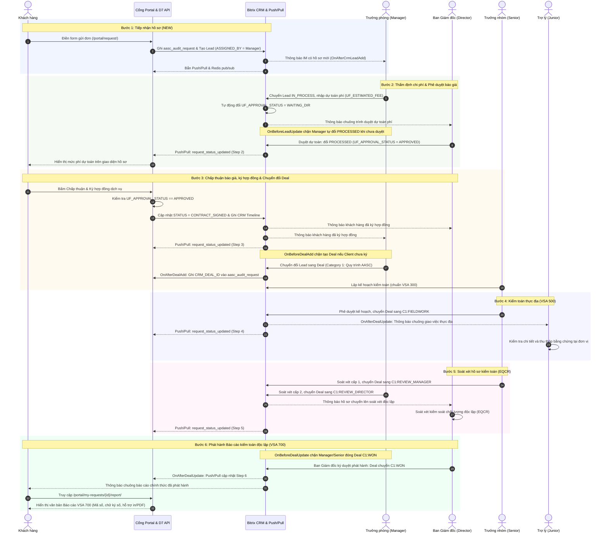

# dev-bitrix24

Hệ thống tiếp nhận và quản lý hồ sơ dịch vụ kiểm toán AASC xây dựng trên nền tảng Bitrix24 On-Premise bằng chuẩn lập trình Bitrix D7 Framework. Toàn bộ mã nguồn tùy biến đặt trong thư mục `local/` và giao diện người dùng đặt trong `portal/`, tuân thủ nguyên tắc không chỉnh sửa thư mục lõi `/bitrix/`.

Hệ thống quản lý toàn bộ chu trình xử lý hồ sơ kiểm toán theo Chuẩn mực Kiểm toán Việt Nam (VSA): tiếp nhận yêu cầu trực tuyến, lập dự toán phí, phê duyệt phân cấp, ký kết hợp đồng điện tử, kiểm toán thực địa, soát xét nhiều cấp và phát hành báo cáo kiểm toán độc lập theo chuẩn mực VSA 700.

## Quy trình nghiệp vụ 6 bước theo chuẩn VSA

Quy trình xử lý hồ sơ kiểm toán gồm 6 bước tuần tự, kiểm soát thẩm quyền chặt chẽ giữa khách hàng và các bộ phận chuyên môn AASC:



### Bước 1: Tiếp nhận hồ sơ (Trạng thái: NEW, IN_PROCESS)

- Khách hàng đăng ký hoặc đăng nhập tài khoản tại `/portal/auth/` (thuộc nhóm `PORTAL_CLIENTS`, Group ID 17).
- Khách hàng điền biểu mẫu yêu cầu kiểm toán tại `/portal/request/`, gồm: tên doanh nghiệp, mã số thuế, doanh thu năm, người liên hệ, số điện thoại, email và loại dịch vụ kiểm toán.
- Controller `\Aasc\Audit\Controller\Request::sendAction()` xác thực dữ liệu, ghi bản ghi vào bảng D7 `aasc_audit_request` với trạng thái `NEW`.
- Service `\Aasc\Audit\Service\CrmBridgeService::createLeadFromRequest()` tự động tạo bản ghi `CRM_LEAD` tương ứng, lưu mã số thuế và quy mô doanh thu vào trường ghi chú, gán tiền tệ VND và phân công ban đầu cho Trưởng phòng kiểm toán (`manager`).
- Sự kiện `OnAfterCrmLeadAdd` gửi thông báo nội bộ qua module IM (`CIMNotify`) tới Trưởng phòng kiểm toán, đồng thời gửi bản tin JSON vào kênh Redis pub/sub và đẩy sự kiện qua Bitrix Push & Pull (`new_audit_request`).

### Bước 2: Thẩm định và lập dự toán chi phí (Trạng thái: PROCESSED, APPROVED)

- Trưởng phòng kiểm toán (`manager`) truy cập CRM Lead, đổi trạng thái sang `IN_PROCESS` và nhập chi phí dự toán vào trường `OPPORTUNITY` hoặc `UF_ESTIMATED_FEE`.
- Handler `OnBeforeLeadUpdate` tự động chuyển trường trạng thái phê duyệt `UF_APPROVAL_STATUS` sang `WAITING_DIR` (Chờ Ban Giám đốc duyệt), gửi thông báo chuông tới Ban Giám đốc (`director`) và ghi nhận vào CRM Timeline.
- Cơ chế kiểm soát thẩm quyền: Trưởng phòng (`manager`) không có quyền tự chuyển Lead sang trạng thái `PROCESSED` hoặc `PROPOSAL_SENT` để phát hành báo giá nếu chưa có phê duyệt `APPROVED` từ Ban Giám đốc. Nếu cố tình thao tác, `OnBeforeLeadUpdate` chặn lại và báo lỗi quy trình.
- Ban Giám đốc (`director`) kiểm tra phương án dự toán và duyệt bằng cách chuyển trạng thái Lead sang `PROCESSED`, trường `UF_APPROVAL_STATUS` cập nhật thành `APPROVED`. Hệ thống ghi nhận vào CRM Timeline và gửi thông báo chuông cho Trưởng phòng.
- Handler `OnAfterLeadUpdate` đẩy sự kiện qua WebSocket Bitrix Push & Pull (`request_status_updated`) về giao diện Stepper của khách hàng để cập nhật tiến độ sang bước 2.

### Bước 3: Chấp thuận báo giá và ký hợp đồng dịch vụ (Trạng thái: CONTRACT_SIGNED, Deal C1:PREPARATION)

- Khách hàng theo dõi chi tiết hồ sơ tại `/portal/my-requests/{id}/`.
- Khi báo giá đã được Ban Giám đốc duyệt (`APPROVED`), giao diện hiển thị khung dự toán chi phí kèm nút xác nhận ký hợp đồng.
- Khách hàng bấm ký: Controller `\Aasc\Audit\Controller\Request::signContractAction()` kiểm tra trạng thái phê duyệt, cập nhật trạng thái bảng `aasc_audit_request` thành `CONTRACT_SIGNED`.
- Hệ thống ghi nhận xác nhận ký vào CRM Timeline của Lead, gửi thông báo chuông cho Ban Giám đốc (`director`) và Trưởng phòng (`manager`), đồng thời đẩy WebSocket cập nhật tiến trình lên bước 3.
- Cơ chế bảo vệ chuyển đổi: Nếu nhân viên trong CRM cố tình chuyển trạng thái Lead sang `CONVERTED` hoặc tạo Deal mới khi khách hàng chưa ký hợp đồng trên Portal, `OnBeforeLeadUpdate` và `OnBeforeDealAdd` chặn thao tác và hiển thị thông báo lỗi quy trình.
- Sau khi khách hàng đã ký, nhân viên chuyển đổi Lead sang Hợp đồng (Deal) trong Deal Category 1 (Quy trình kiểm toán AASC).
- Khi Deal được tạo: `OnAfterDealAdd` lưu mã `CRM_DEAL_ID` vào bảng `aasc_audit_request`, đẩy sự kiện WebSocket cập nhật mã Deal cho khách hàng. Trưởng nhóm kiểm toán (`senior`) tiến hành lập kế hoạch kiểm toán theo chuẩn VSA 300.

### Bước 4: Kiểm toán thực địa (Giai đoạn Deal: C1:FIELDWORK)

- Trưởng nhóm kiểm toán (`senior`) hoàn tất kế hoạch kiểm toán và chuyển Deal sang giai đoạn `C1:FIELDWORK`.
- Kiểm soát phân quyền: Chỉ Trưởng nhóm kiểm toán (`senior`) hoặc cấp quản lý mới có quyền phê duyệt chuyển sang kiểm toán thực địa.
- Handler `OnAfterDealUpdate` phát hiện giai đoạn `C1:FIELDWORK`, tự động gửi thông báo chuông giao việc cho Trợ lý kiểm toán (`junior`) bắt đầu thu thập bằng chứng kiểm toán theo chuẩn VSA 500.
- Sự kiện Push & Pull tự động cập nhật thanh tiến độ của khách hàng lên bước 4.

### Bước 5: Soát xét hồ sơ kiểm toán nhiều cấp (Giai đoạn Deal: C1:REVIEW_MANAGER, C1:REVIEW_DIRECTOR)

- Soát xét cấp 1: Trưởng nhóm kiểm toán (`senior`) soát xét giấy làm việc của trợ lý, sau đó chuyển Deal sang `C1:REVIEW_MANAGER`. Chỉ Trưởng nhóm hoặc cấp quản lý mới có quyền chuyển giai đoạn này.
- Soát xét cấp 2: Chủ nhiệm kiểm toán (`manager`) soát xét toàn bộ hồ sơ kiểm toán và chuyển Deal sang `C1:REVIEW_DIRECTOR`. Chỉ Chủ nhiệm kiểm toán hoặc Ban Giám đốc mới có quyền chuyển giai đoạn này.
- Soát xét kiểm soát chất lượng độc lập (EQCR): Ban Giám đốc (`director`) thực hiện soát xét chất lượng cuộc kiểm toán trước khi phát hành báo cáo.
- Sự kiện Push & Pull tự động cập nhật thanh tiến độ của khách hàng lên bước 5.

### Bước 6: Phát hành báo cáo kiểm toán độc lập chính thức (Giai đoạn Deal: C1:WON)

- Thẩm quyền tối cao: Chỉ Ban Giám đốc (`director`) hoặc Quản trị viên (`admin`) mới có quyền chuyển Deal sang giai đoạn `C1:WON` (hoàn tất cuộc kiểm toán) hoặc `C1:LOSE` (hủy cuộc kiểm toán). Trưởng phòng và Trưởng nhóm không có quyền đóng hợp đồng. Nếu tài khoản khác thao tác, `OnBeforeDealUpdate` chặn lại và ném lỗi nghiệp vụ.
- Khi Ban Giám đốc duyệt `C1:WON`: `OnAfterDealUpdate` gửi thông báo cho khách hàng và đẩy WebSocket sang bước 6.
- Trên Cổng thông tin, khách hàng được mở nút xem và tải Báo cáo kiểm toán độc lập tại `/portal/my-requests/{id}/report/` (component `aasc:audit.report.view`).
- Báo cáo trình bày theo đúng cấu trúc chuẩn mực VSA 700: số hiệu báo cáo, ý kiến kiểm toán chấp nhận toàn phần, chữ ký số điện tử xác thực của Trưởng nhóm kiểm toán và Giám đốc kiểm toán đại diện Hãng Kiểm toán AASC.

## Ma trận phân quyền người dùng

| Vai trò | Tài khoản mẫu | Vị trí công tác | Quyền hạn và trách nhiệm trong hệ thống |
| :--- | :--- | :--- | :--- |
| Khách hàng doanh nghiệp | Tự đăng ký qua portal | Đại diện khách hàng | Gửi hồ sơ kiểm toán, xem tiến độ trực tiếp, trao đổi ghi chú hai chiều với kiểm toán viên, chấp thuận dự toán chi phí và ký hợp đồng, xem và in báo cáo VSA 700. Tài khoản bị cách ly hoàn toàn khỏi khu vực Intranet. |
| Trợ lý kiểm toán (Junior) | `junior` | Trợ lý kiểm toán | Nhận phân công đoàn kiểm toán, thực hiện kiểm toán thực địa (C1:FIELDWORK), thu thập bằng chứng kiểm toán theo VSA 500. |
| Trưởng nhóm kiểm toán (Senior) | `senior` | Trưởng nhóm kiểm toán | Lập kế hoạch kiểm toán (VSA 300), duyệt chuyển sang kiểm toán thực địa, soát xét hồ sơ cấp 1 và chuyển tiếp cho Chủ nhiệm kiểm toán (C1:REVIEW_MANAGER). |
| Chủ nhiệm kiểm toán / Trưởng phòng (Manager) | `manager` | Trưởng phòng Kiểm toán 1 | Tiếp nhận Lead ban đầu, phân công đoàn kiểm toán, lập dự toán chi phí kiểm toán (UF_ESTIMATED_FEE), soát xét cấp 2 và trình hồ sơ lên Ban Giám đốc (C1:REVIEW_DIRECTOR). Không có quyền tự duyệt phát hành báo giá và không có quyền đóng Deal. |
| Ban Giám đốc / Partner (Director) | `director` | Phó Tổng Giám đốc | Thẩm quyền phê duyệt dự toán chi phí phát hành báo giá (UF_APPROVAL_STATUS = APPROVED), soát xét kiểm soát chất lượng độc lập (EQCR), thẩm quyền độc quyền ký phát hành báo cáo kiểm toán chính thức (C1:WON) hoặc hủy cuộc kiểm toán (C1:LOSE). |
| Quản trị viên hệ thống | `admin` | Quản trị viên | Toàn quyền cấu hình module, quản trị người dùng, phân quyền và giám sát hệ thống. |

## Cơ chế kiểm soát nghiệp vụ và an toàn dữ liệu

- Chặn đóng Deal trái thẩm quyền: Bắt sự kiện `OnBeforeCrmDealUpdate`. Nếu giai đoạn thuộc nhóm kết thúc (`C1:WON`, `C1:LOSE`, `WON`, `LOSE`, `APOLOGY`), hệ thống kiểm tra quyền Director. Tài khoản khác bị hủy thao tác và trả thông báo lỗi trực tiếp trên giao diện CRM.
- Chặn phát hành báo giá khi chưa duyệt: Bắt sự kiện `OnBeforeCrmLeadUpdate`. Chỉ khi `UF_APPROVAL_STATUS` có giá trị `APPROVED` và trường số tiền lớn hơn 0 thì Lead mới được chuyển sang `PROCESSED` hoặc `PROPOSAL_SENT`.
- Chặn chuyển đổi Lead sang Deal khi chưa ký hợp đồng: Bắt sự kiện `OnBeforeCrmLeadUpdate` và `OnBeforeCrmDealAdd`. Nếu hồ sơ trong bảng `aasc_audit_request` chưa có trạng thái `CONTRACT_SIGNED`, hệ thống ngăn chặn việc chuyển đổi Lead sang `CONVERTED` hoặc tạo Deal mới.
- Khóa đơn vị tiền tệ VND: Mọi thao tác cập nhật Lead và Deal đều được Handler ép trường `CURRENCY_ID` và `ACCOUNT_CURRENCY_ID` về giá trị cố định `VND`.
- Cách ly mạng nội bộ Intranet: Bắt sự kiện `OnBeforeProlog` qua `PortalAccessHandler`. Người dùng thuộc nhóm Khách hàng (`PORTAL_CLIENTS`, Group ID 17) khi truy cập các tiền tố Intranet (`/crm/`, `/company/`, `/stream/`, `/workgroups/`, `/timeman/`, `/bizproc/`, `/docs/`, v.v.) sẽ tự động bị chuyển hướng về `/portal/`. Khách vãng lai truy cập trang chủ gốc `/` được chuyển hướng về `/portal/`.

## Trao đổi hai chiều và đồng bộ thời gian thực

- Trao đổi hai chiều qua CRM Timeline:
  - Khách hàng gửi ghi chú từ trang chi tiết hồ sơ thông qua Controller `\Aasc\Audit\Controller\Request::addNoteAction()`.
  - Nội dung ghi chú được ghi trực tiếp vào bảng `b_crm_timeline` của Lead, đồng thời gửi thông báo chuông cho nhân viên phụ trách hồ sơ.
  - Phản hồi từ kiểm toán viên trong CRM Timeline hiển thị trực tiếp trên giao diện của khách hàng và phát sóng thời gian thực qua sự kiện `new_request_note`.
- Đồng bộ thời gian thực qua Bitrix Push & Pull WebSocket:
  - Client đăng ký kênh theo dõi qua `CPullWatch::Add($userId, 'AASC_AUDIT_REQUEST_' . $id)`.
  - Khi có thay đổi trạng thái từ Lead hoặc Deal, backend phát sự kiện `request_status_updated`.
  - Giao diện Stepper trên Portal tự động cập nhật trạng thái và hiển thị khối chức năng tương ứng (khung ký hợp đồng ở bước 2, khung báo cáo ở bước 6) mà không cần tải lại trang thủ công.
- Cơ chế socket và Controller mẫu email:
  - Khi có Lead mới từ Portal, hệ thống gửi bản tin JSON trực tiếp vào kênh Redis pub/sub qua cấu hình `REDIS_CHANNEL`.
  - Controller `\Aasc\Audit\Controller\Template::getAction()` cung cấp nội dung mẫu email từ IBlock `aasc_email_templates` theo mã code cho n8n hoặc dịch vụ nội bộ, bảo mật qua IP whitelist và header `X-API-Key`, hỗ trợ lưu đệm D7 Cache.

## Cấu trúc thư mục

```text
dev-bitrix24/
├── .github/
│   └── workflows/
│       └── deploy.yml              # Pipeline CI/CD tự động chạy khi push vào master/main
├── local/                          # Thư mục mã nguồn tùy biến
│   ├── components/
│   │   └── aasc/
│   │       ├── audit.report.view/          # Component hiển thị báo cáo kiểm toán độc lập VSA 700
│   │       ├── audit.request/              # Component biểu mẫu gửi yêu cầu kiểm toán
│   │       └── audit.request.detail/       # Component chi tiết hồ sơ, Stepper 6 bước, ký hợp đồng và Timeline
│   ├── modules/
│   │   └── aasc.audit/             # Module D7 nghiệp vụ
│   │       ├── lib/
│   │       │   ├── controller/
│   │       │   │   ├── auth.php            # Controller đăng nhập, đăng ký, đăng xuất portal
│   │       │   │   ├── request.php         # Controller gửi đơn, thêm ghi chú, ký hợp đồng, đồng bộ status
│   │       │   │   └── template.php        # Controller cung cấp mẫu email giao dịch có cache
│   │       │   ├── handler/
│   │       │   │   ├── leadapprovalhandler.php  # Event handler kiểm soát phân quyền Lead và Deal
│   │       │   │   └── portalaccesshandler.php  # Event handler cách ly mạng nội bộ Intranet
│   │       │   ├── model/
│   │       │   │   └── auditrequesttable.php    # ORM DataManager ánh xạ bảng aasc_audit_request
│   │       │   └── service/
│   │       │       └── crmbridgeservice.php     # Service khởi tạo CRM Lead từ yêu cầu kiểm toán
│   │       ├── .settings.php       # Khai báo routing và controller namespace D7
│   │       └── include.php         # Nạp module và đăng ký class PSR-4
│   ├── php_interface/
│   │   ├── init.php                # Khởi tạo toàn cục, nạp .env, đăng ký event CRM và Prolog
│   │   └── scripts/
│   │       ├── clear_cache.php     # Script xóa cache Bitrix sau triển khai
│   │       ├── create_departments.php # Script cập nhật sơ đồ phòng ban
│   │       └── seed_platform.php   # Script khởi tạo bảng DB, User, User Fields và IBlock
│   ├── routes/
│   │   └── web.php                 # Cấu hình D7 routing cho chi tiết hồ sơ và báo cáo VSA 700
│   └── templates/
│       └── aasc_portal/            # Site template cho giao diện Portal khách hàng
├── portal/                         # Các trang cổng thông tin khách hàng
│   ├── auth/                       # Trang đăng nhập và đăng ký tài khoản
│   ├── my-requests/                # Trang danh sách hồ sơ kiểm toán của người dùng
│   ├── request/                    # Trang điền biểu mẫu gửi yêu cầu kiểm toán mới
│   ├── services/                   # Trang giới thiệu các dịch vụ kiểm toán AASC
│   └── index.php                   # Trang chủ cổng thông tin khách hàng
├── .env.example                    # Tệp mẫu khai báo biến môi trường
├── .gitignore                      # Danh sách tệp loại trừ khỏi kho mã nguồn
├── composer.json                   # Khai báo thư viện (vlucas/phpdotenv, predis/predis)
└── README.md                       # Tài liệu hướng dẫn hệ thống
```

## Cấu hình môi trường

Sao chép tệp cấu hình mẫu khi cài đặt trên môi trường mới:

```bash
cp .env.example .env
```

Các biến môi trường trong tệp `.env`:

| Biến | Ý nghĩa | Giá trị mẫu |
| :--- | :--- | :--- |
| `APP_ENV` | Môi trường thực thi | `production` hoặc `local` |
| `REDIS_HOST` | Địa chỉ máy chủ Redis | `127.0.0.1` |
| `REDIS_PORT` | Cổng kết nối máy chủ Redis | `6379` |
| `REDIS_PASSWORD` | Mật khẩu xác thực Redis | `mat_khau_redis` |
| `REDIS_CHANNEL` | Kênh pub/sub sự kiện | `bitrix:pull:events` |
| `N8N_WEBHOOK_URL` | Địa chỉ webhook n8n nhận dữ liệu Lead | `http://127.0.0.1:5678/webhook/lead-created` |
| `DEFAULT_USER_PASSWORD` | Mật khẩu mặc định khi nạp dữ liệu mẫu | `Aasc@2026Pass!` |

## Cài đặt và khởi tạo dữ liệu

### 1. Cài đặt thư viện phụ thuộc

```bash
composer install --no-dev --optimize-autoloader
```

### 2. Khởi tạo dữ liệu nền tảng

Chạy script để tự động tạo bảng database, tài khoản mẫu, trường tùy biến và danh mục dịch vụ:

```bash
php local/php_interface/scripts/seed_platform.php
```

Script thực hiện các tác vụ:
- Tạo bảng `aasc_audit_request` trong cơ sở dữ liệu nếu chưa tồn tại.
- Tạo phòng ban "Ban Giám đốc" và "Phòng Kiểm toán 1" trong cơ cấu tổ chức Bitrix.
- Khởi tạo 4 tài khoản người dùng mẫu: `director`, `manager`, `senior`, `junior` với mật khẩu cấu hình từ biến `DEFAULT_USER_PASSWORD`.
- Khởi tạo 3 trường tùy biến trên CRM Lead: `UF_AUDIT_TEAM` (danh sách nhân viên đoàn kiểm toán), `UF_ESTIMATED_FEE` (số tiền dự toán) và `UF_APPROVAL_STATUS` (danh mục trạng thái duyệt DRAFT, WAITING_MGR, WAITING_DIR, APPROVED, REJECTED).
- Tạo Information Block `audit_services` và nạp 4 dịch vụ kiểm toán mẫu: Kiểm toán Báo cáo tài chính, Kiểm toán Quyết toán vốn đầu tư, Thẩm định giá tài sản, Tư vấn thuế doanh nghiệp.

### 3. Xóa cache hệ thống

```bash
php local/php_interface/scripts/clear_cache.php
```

## Quy trình triển khai CI/CD

Mã nguồn được đồng bộ tự động lên máy chủ web (`/var/www/html/`) qua GitHub Actions self-hosted runner khi đẩy mã nguồn vào nhánh `master` hoặc `main`:

1. Runner tải mã nguồn từ nhánh chỉ định qua `actions/checkout@v4`.
2. Chạy `composer install --no-dev --optimize-autoloader --no-interaction`.
3. Đồng bộ các thư mục `local/`, `portal/` và `vendor/` vào thư mục webroot `/var/www/html/` qua `rsync`.
4. Thiết lập quyền sở hữu `bitrix:nginx` và phân quyền thư mục `775`, tệp tin `664`.
5. Thực thi script `clear_cache.php` để xóa cache toàn hệ thống.
6. Nạp lại tiến trình `php-fpm` qua lệnh `systemctl reload php-fpm`.
